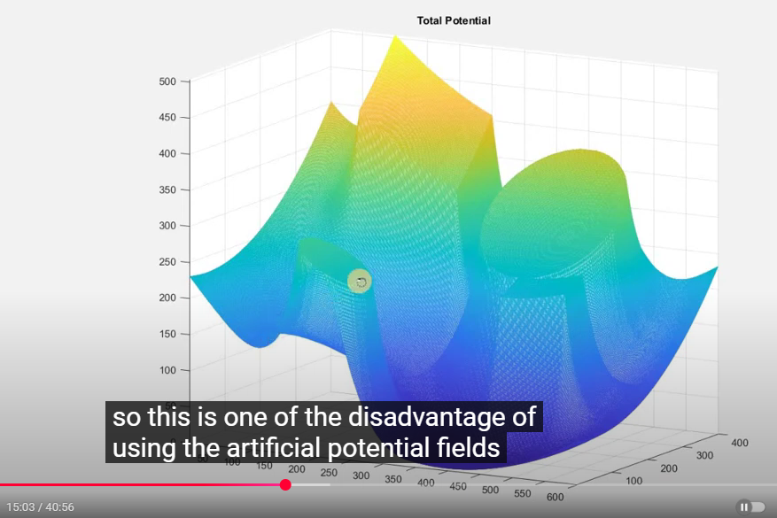

QUESTION: Is it good to combine DA and Dijkstra? Explain the main purpose of each algorithm.

- **Dijkstra’s Algorithm (DA):**  
  **Main Purpose:**  
  Dijkstra’s algorithm is a **global path planning** algorithm that finds the shortest (or least costly) path from a start point to all other points in a grid or graph. It guarantees finding an optimal path given a cost metric, but it doesn't account for dynamic obstacles or provide smooth real-time adjustments.

- **Artificial Potential Field (APF):**  
  **Main Purpose:**  
  APF is a **local reactive** method. It creates a virtual “field” where the goal exerts an attractive force and obstacles exert repulsive forces. This field guides the robot in real time, smoothing out the path and handling small dynamic obstacles. However, APF can sometimes get stuck in local minima.

### Combining Global and Local Methods

While Dijkstra’s algorithm (or any global planner like A*) and APF serve different roles, **combining them can be very beneficial**:

- **Global Planning (Dijkstra’s Algorithm):**  
  - Provides an overall, optimal path from the start to the goal based on the current environment.
  - Ensures that the path is collision-free and minimizes overall cost.

- **Local Adjustment (APF):**  
  - Helps to smooth the path, especially around obstacles.
  - Reacts to unexpected or dynamic obstacles that might not be accounted for in the static global plan.
  - Provides continuous, fine-tuned corrections that ensure the robot stays on a safe trajectory.

### Is It Good to Combine Them?

Yes, combining them is a common and effective strategy:
- **Global Planner (Dijkstra’s Algorithm):** Gives you a broad plan that ensures you reach the goal optimally.
- **Local Planner (APF):** Refines that plan in real time, adapting to local changes or inaccuracies in the map.

**Benefits of Combining:**
- **Robustness:** The global planner prevents getting trapped in local minima while APF handles real-time adjustments.
- **Smooth Navigation:** The overall path is optimal, and the local adjustments ensure smooth transitions around obstacles.
- **Flexibility:** You can adapt to both known static obstacles (handled well by the global planner) and unforeseen dynamic obstacles (handled by the local reactive system).

By integrating both methods, you can leverage the strengths of each algorithm, leading to a navigation system that is both globally optimal and locally responsive.

---

QUESTION: If I don't combine APF, or vice versa, will the program be able to detect and update the new path real-time?

ANSWER: Yes, the program can still update the path in real-time even if you use just one of the methods, but there are important trade-offs:

1. **Using Only DA (Global Planner):**
   - **Real-Time Replanning:**  
     Dijkstra’s algorithm can re-run whenever a new obstacle is detected, providing an updated global path. This means that if a new obstacle appears, your system can recalculate and update the entire path.
   - **Downsides:**  
     Without APF, the path might be less smooth. The car may encounter sharp turns or abrupt changes in direction because DA doesn't provide the continuous, fine-grained adjustments that APF does.

2. **Using Only APF (Local Planner):**
   - **Real-Time Responsiveness:**  
     APF reacts immediately to changes, providing real-time steering corrections based on the current obstacle configuration.
   - **Downsides:**  
     APF alone may struggle with global navigation because it can get stuck in local minima (e.g., small traps or loops) and may not always find the best overall route to the destination. It’s excellent for smoothing and local adjustments but isn’t designed for comprehensive global path planning.

**In Summary:**  
- **Without APF:** Your system can detect new obstacles and recalculate the path globally with DA, but the resulting path might be less smooth, causing possible issues in vehicle control.
- **Without DA:** Relying solely on APF allows real-time local adjustments, but you might lose a clear global strategy, and the car could get trapped in suboptimal paths.

Combining both gives you the best of both worlds: a globally optimal path with DA and smooth, adaptive local corrections with APF.

---

QUESTION: Explain the mechanism of DA and APF in this program

In this program, two main techniques work together to generate a safe, smooth path:

### **1. Artificial Potential Field (APF)**

**Goal:**  
The APF provides a way to influence the cost of each cell in the environment based on how “desirable” it is to travel there. It does this by combining two types of virtual “forces”:

- **Attractive Force (Potential):**  
  This pulls the robot toward the goal. In our program, for each grid cell, we calculate an attractive potential that increases with the distance from the goal. Mathematically, it’s a quadratic function:  
  \[
  U_{\text{attr}} = \frac{1}{2} \zeta \, \text{(distance to goal)}^2
  \]
  Here, \(\zeta\) is a tuning parameter that determines how strongly the cell is “pulled” toward the goal.

- **Repulsive Force (Potential):**  
  This pushes the robot away from obstacles. For each cell, if it’s within an “influence radius” of any obstacle, we add a repulsive cost that increases sharply as the cell gets closer to the obstacle. The repulsive potential for a cell is computed as:
  \[
  U_{\text{rep}} = \frac{1}{2} \eta \left(\frac{1}{d} - \frac{1}{d_{\text{infl}}}\right)^2 \quad \text{if } d \le d_{\text{infl}}
  \]
  where \(d\) is the distance from the cell to the obstacle, \(d_{\text{infl}}\) is the influence radius, and \(\eta\) is a parameter that scales the repulsive effect. Cells inside an obstacle are marked as having infinite cost (making them non-traversable).

**Mechanism in the Code:**  
- The program loops through every cell in the grid.  
- For each cell:
  - It computes \(U_{\text{attr}}\) based on the distance to the goal (which is either Destination A or B, depending on the leg).
  - It then checks each obstacle:
    - If the cell is within the influence radius (and not inside the obstacle), it adds a repulsive cost.
  - Finally, it adds these APF values to a base cost (usually 1 for free space).
  
This results in a **cost grid** where cells near obstacles have a very high cost, and cells far from obstacles but close to the goal have a lower cost.

### **2. Dijkstra’s Algorithm (DA)**

**Goal:**  
Dijkstra’s algorithm is used to find the least-cost (i.e., safest and most direct) path from a starting cell to a goal cell on a grid. Since we have incorporated APF values into our cost grid, the algorithm is effectively “repelled” from high-cost (obstacle) regions while being “attracted” toward the goal.

**Mechanism in the Code:**  
- **Initialization:**  
  - A distance array (`dist`) is created and initialized with infinite values for all cells except the start cell, which is set to 0.
  - A priority queue (`pq`) is used to manage which cell to explore next (the cell with the lowest accumulated cost is chosen).
  - A “cameFrom” structure keeps track of predecessors for each cell, so the path can later be reconstructed.
  
- **Exploration:**  
  - The algorithm iteratively picks the cell with the smallest current cost from the priority queue.
  - It then examines its 4-connected neighbors (up, down, left, right).
  - For each neighbor that is traversable (i.e., not an infinite cost cell), the algorithm computes a new cost by adding the cost of moving into that neighbor (from the APF-enhanced grid) to the current cost.
  - If this new cost is lower than the previously recorded cost for that neighbor, the cost is updated, and the neighbor is added to the priority queue.
  
- **Path Reconstruction:**  
  - Once the goal cell is reached, the algorithm stops.
  - The program then backtracks from the goal cell to the start cell using the “cameFrom” pointers to reconstruct the complete path.

### **How They Work Together**

- **APF Sets the Stage:**  
  By shaping the cost grid, the APF ensures that the regions near obstacles have a high cost, effectively “pushing” the robot away from them, while “pulling” it toward the goal.

- **Dijkstra Finds the Best Route:**  
  Dijkstra’s algorithm then uses this cost grid to compute the lowest-cost path from the start to the goal. Because the cost grid includes the effects of both the attractive and repulsive potentials, the resulting path naturally avoids obstacles while progressing toward the destination.

- **Smoothing and Upsampling:**  
  The raw path from Dijkstra can be jagged because it follows the discrete grid. To make the path smoother and more natural, we apply a smoothing function (using cubic smoothing splines) and upsample the path to generate more intermediate points. This results in a smoother, slower-moving red dot during animation.

### **Summary**

- **APF**:  
  - **Attractive Potential:** Pulls the robot toward the goal.  
  - **Repulsive Potential:** Pushes the robot away from obstacles.
  - **Combined Cost:** The grid is modified so that cells have higher cost near obstacles and lower cost near the goal.

- **Dijkstra’s Algorithm:**  
  - Finds the minimum accumulated cost path on this grid, effectively guiding the robot along a safe route.
  - The reconstructed path is then smoothed for a natural-looking trajectory.

Together, these mechanisms let the robot plan and follow a path that avoids obstacles and reaches the destination while also providing a basis for smoothing the path for a visually pleasing and slow-moving animation.

---

QUESTION: Disadvantage of APF? (Youtube)

ANSWER:  - In some cases, the ball may get stuck at the local minima (a low APF area of an obstacle, but not the goal) 

---

QUESTION: Explain PotentialFieldScript.m

Below is an explanation of the program, step by step:

### Overview

This MATLAB script demonstrates an approach to path planning using the **Artificial Potential Field (APF)** method. In this approach, the environment is modeled as a grid where:
- **Obstacles** generate a **repulsive potential** (making nearby areas “costly”).
- The **goal** generates an **attractive potential** (making cells near it “desirable”).

The total potential field is the sum of the repulsive and attractive potentials. Then a gradient-based planner is used to “slide” a ball (or red dot) from a start point to the goal by following the downhill gradient of the total potential.

### Detailed Explanation

#### 1. Generate the Grid and Define the Workspace

```matlab
nrows = 400;
ncols = 600;
[x, y] = meshgrid(1:ncols, 1:nrows);
```

- **Grid Creation:**  
  A 2D grid is generated with 400 rows and 600 columns. The variables `x` and `y` hold the coordinates of every cell in the grid.

#### 2. Create Obstacles

```matlab
obstacle = false(nrows, ncols);
...
obstacle(300:end, 100:250) = true;
obstacle(150:200, 400:500) = true;
t = ((x - 200).^2 + (y - 50).^2) < 50^2;
obstacle(t) = true;
t = ((x - 400).^2 + (y - 300).^2) < 100^2;
obstacle(t) = true;
```

- **Obstacle Representation:**  
  The variable `obstacle` is a logical matrix (of the same size as the grid) where `true` represents the presence of an obstacle.
  
- **Rectangular Obstacles:**  
  Two rectangular regions are set to `true`:
  - One covering rows 300 to the end and columns 100 to 250.
  - Another covering rows 150 to 200 and columns 400 to 500.
  
- **Circular Obstacles:**  
  Two circular obstacles are created using equations for a circle:
  - One centered at (200, 50) with a radius of 50.
  - Another centered at (400, 300) with a radius of 100.

#### 3. Compute the Distance Transform

```matlab
d = bwdist(obstacle);
```

- **Distance Transform:**  
  The function `bwdist` computes the Euclidean distance from every cell in the grid to the nearest obstacle. This distance will later be used to create the repulsive potential.

#### 4. Rescale and Transform Distances

```matlab
d2 = (d/100) + 1;
d0 = 2;
nu = 800;
repulsive = nu*((1./d2 - 1/d0).^2);
repulsive(d2 > d0) = 0;
```

- **Rescaling:**  
  The distances are scaled by dividing by 100 and then offset by 1. This normalization adjusts the distances into a usable range.
  
- **Parameters:**  
  - `d0` is the influence distance threshold: cells with a scaled distance greater than `d0` are not affected by obstacles.
  - `nu` is a scaling factor for the repulsive potential.
  
- **Repulsive Potential Calculation:**  
  For each cell, if its distance \( d2 \) is less than or equal to \( d0 \), a repulsive potential is computed using:
  \[
  U_{\text{rep}} = \nu\left(\frac{1}{d2} - \frac{1}{d0}\right)^2
  \]
  For cells beyond the influence distance (\( d2 > d0 \)), the repulsive potential is set to zero.

#### 5. Display the Repulsive Potential

```matlab
figure;
m = mesh(repulsive);
m.FaceLighting = 'phong';
axis equal;
title('Repulsive Potential');
```

- **Visualization:**  
  A mesh plot of the repulsive potential is created. The `phong` lighting gives it a 3D appearance. This shows how the repulsive potential “peaks” near obstacles.

#### 6. Compute the Attractive Potential

```matlab
goal = [400, 50];
xi = 1/700;
attractive = xi * ((x - goal(1)).^2 + (y - goal(2)).^2);
```

- **Goal Setting:**  
  The goal is defined at the point (400, 50).
  
- **Attractive Potential Calculation:**  
  The attractive potential is a quadratic function that increases with the squared distance from the goal:
  \[
  U_{\text{attr}} = \xi \left[(x - \text{goal}_x)^2 + (y - \text{goal}_y)^2\right]
  \]
  Here, \( \xi \) is a small constant (1/700) that scales the attractive force.

#### 7. Display the Attractive Potential

```matlab
figure;
m = mesh(attractive);
m.FaceLighting = 'phong';
axis equal;
title('Attractive Potential');
```

- **Visualization:**  
  A mesh plot of the attractive potential is shown. This surface slopes downward toward the goal.

#### 8. Display the Configuration Space

```matlab
figure;
imshow(~obstacle);
hold on;
plot(goal(1), goal(2), 'r.', 'MarkerSize', 25);
hold off;
axis([0 ncols 0 nrows]);
axis xy;
axis on;
xlabel('x');
ylabel('y');
title('Configuration Space');
```

- **Configuration Space:**  
  The binary map (free space vs. obstacles) is displayed using `imshow`. The goal is marked with a large red dot. This gives a top-down view of the workspace.

#### 9. Combine the Attractive and Repulsive Potentials

```matlab
f = attractive + repulsive;
figure;
m = mesh(f);
m.FaceLighting = 'phong';
axis equal;
title('Total Potential');
```

- **Total Potential Field:**  
  The overall potential \( f \) is computed as the sum of the attractive and repulsive potentials.  
  - Near obstacles, the high repulsive values dominate, making those areas “expensive” to traverse.
  - As you move toward the goal, the attractive potential pulls the field downward.
  
- **Visualization:**  
  A mesh plot of the total potential field is created.

#### 10. Plan the Route Using a Gradient-Based Planner

```matlab
start = [50, 350];
route = GradientBasedPlanner(f, start, goal, 1000);
```

- **Route Planning:**  
  A function `GradientBasedPlanner` is called (presumably defined elsewhere). It uses the total potential \( f \) and starts at the point `[50, 350]` (in image coordinates) to compute a path to the goal.  
  - The planner likely works by following the negative gradient of \( f \) (i.e., "sliding down" the potential hill) until it reaches the goal.
  - The number `1000` might represent the maximum number of iterations or steps.

#### 11. Plot the Energy Surface and Animate a Ball

```matlab
figure;
m = mesh(f);
axis equal;
```

- **Energy Surface Plot:**  
  The energy surface (total potential) is plotted again to serve as a backdrop.

```matlab
[sx, sy, sz] = sphere(20);
scale = 20;
sx = scale*sx;
sy = scale*sy;
sz = scale*(sz+1);
hold on;
p = mesh(sx, sy, sz);
p.FaceColor = 'red';
p.EdgeColor = 'none';
p.FaceLighting = 'phong';
hold off;
```

- **Sphere Creation:**  
  A sphere (representing a ball) is generated and scaled.
  
- **Animating the Ball:**  
  A loop is used to animate the sphere along the computed route:
  ```matlab
  for i = 1:size(route,1)
      P = round(route(i,:));
      z = f(P(2), P(1));
      p.XData = sx + P(1);
      p.YData = sy + P(2);
      p.ZData = sz + f(P(2), P(1));
      drawnow;
  end
  ```
  In each iteration:
  - The current route position \( P \) is taken.
  - The sphere’s position is updated so that it appears to “slide” along the potential field. Its z-coordinate is set to the potential value at that point, making it look like it’s rolling downhill.

#### 12. Create a Quiver Plot for the Gradient Field

```matlab
[gx, gy] = gradient(-f);
skip = 20;
figure;
xidx = 1:skip:ncols;
yidx = 1:skip:nrows;
quiver(x(yidx,xidx), y(yidx,xidx), gx(yidx,xidx), gy(yidx,xidx), 0.4);
axis([1 ncols 1 nrows]);
hold on;
ps = plot(start(1), start(2), 'r.', 'MarkerSize', 30);
pg = plot(goal(1), goal(2), 'g.', 'MarkerSize', 30);
p3 = plot(route(:,1), route(:,2), 'r', 'LineWidth', 2);
```

- **Gradient Computation:**  
  The gradients `gx` and `gy` of the negative potential field (`-f`) are computed. The negative gradient points in the direction of steepest descent.
  
- **Quiver Plot:**  
  A quiver plot is drawn (with some points skipped for clarity) to visualize the vector field. This shows the direction a particle would “slide” if it followed the gradient.
  
- **Overlaying Points:**  
  The start and goal are plotted, and the route (as computed by the planner) is drawn on top.


### Summary

- **APF Mechanism:**  
  The repulsive potential increases near obstacles (making them “expensive”), while the attractive potential draws the agent toward the goal. The combination results in a potential field with hills (obstacles) and a valley (toward the goal).

- **Delineating the Configuration Space:**  
  The obstacles are defined and visualized, and the distance transform helps compute the repulsive part.

- **Route Planning:**  
  A gradient-based planner uses the total potential field to generate a route from a start point to the goal by “rolling” downhill in the potential field.

- **Visualization & Animation:**  
  Multiple figures show the repulsive, attractive, and total potentials, as well as the configuration space. Finally, the computed route is animated by moving a sphere along the downhill path and displaying the gradient vectors with a quiver plot.

This program is a comprehensive demonstration of how potential fields can be used for path planning and visualization in robotics. 

---

QUESTION: How DA and APF combined and work together?

When you combine DA and APF, you’re essentially leveraging two complementary ideas:

1. **APF (Artificial Potential Field):**  
   - **Attractive Component:** This creates a “pull” toward the goal. Mathematically, the attractive potential is typically a quadratic function of the distance to the goal. It means that the farther you are, the stronger the pull.  
   - **Repulsive Component:** This creates a “push” away from obstacles. It is usually designed so that its value increases steeply as you get closer to an obstacle, making those areas “expensive” or unattractive to traverse.

2. **DA (Dijkstra’s Algorithm):**  
   - This algorithm finds the minimum-cost path through a grid by exploring all nodes in increasing order of accumulated cost. When applied to a grid whose cost at each cell is defined by the APF (plus possibly a base cost), DA naturally finds a path that minimizes the overall “energy” or “cost.”

### How They Work Together in Detail

1. **Cost Grid Construction with APF:**  
   - **Base Cost:** Each grid cell starts with a base cost (often set to 1) indicating the intrinsic cost of moving through free space.
   - **Obstacle Influence (Repulsive Potential):** For each grid cell, if it lies within a certain distance (the influence radius) of an obstacle, a repulsive potential is computed. This is designed to become very large as the cell gets very close to an obstacle.
   - **Goal Influence (Attractive Potential):** For each cell, an attractive potential is computed that increases with the squared distance from the goal. Cells closer to the goal are “cheaper.”
   - **Combined Cost:** The final cost assigned to each cell is the sum of the base cost plus the APF values (attractive plus repulsive). This yields a cost landscape where:
     - Regions near obstacles have very high cost.
     - Regions near the goal have lower cost.
     - Free space farther from both obstacles and the goal has a moderate cost.

2. **Global Path Planning with Dijkstra’s Algorithm:**  
   - **Using the Cost Grid:** Dijkstra’s algorithm is run on the grid where each cell’s cost now reflects both the obstacle repulsion and goal attraction.
   - **Path Search:** Because Dijkstra’s algorithm always expands the node with the smallest accumulated cost first, it “avoids” areas of high cost (near obstacles) while being “pulled” toward areas where the cost is lower (near the goal).
   - **Global Optimality:** The algorithm finds a path that minimizes the total cost from the start to the goal, thereby effectively incorporating both the need to avoid obstacles and the desire to reach the target.

3. **Result – A “Potential-Aware” Path:**  
   - **Smooth Navigation:** Although the discrete grid might yield a jagged, step-like path, it is already guided by the underlying potential field. In other words, the raw path tends to curve away from obstacles and head directly toward the goal.
   - **Post-Processing (Optional):** Often, a smoothing technique (like cubic spline interpolation) is applied to the raw path to further reduce any zigzagging due to grid discretization. This gives a more continuous, natural route.

### Why This Combination Works Well

- **Obstacle Avoidance:** The APF’s repulsive term makes areas near obstacles “expensive” so that DA will choose an alternative route.  
- **Goal Attraction:** The attractive term ensures that even if there is a detour, the overall trend of the cost is lower in the direction of the goal.  
- **Global Optimality:** Dijkstra’s algorithm guarantees that, given the defined cost grid, the path found is optimal with respect to the total accumulated cost.  
- **Adaptability:** If obstacles change or if the goal is updated, you can recompute the cost grid, and DA will find a new optimal route.

### In Summary

- **APF shapes the cost landscape:**  
  - High cost near obstacles (repulsion).  
  - Low cost near the goal (attraction).
- **DA searches this landscape:**  
  It finds the minimum-cost path that naturally avoids high-cost (obstacle) regions and steers toward low-cost (goal) regions.
- **The Result:**  
  A global path that respects both obstacle avoidance and goal convergence. This path can then be smoothed for a better trajectory.

This synergy between DA and APF gives you a robust mechanism for navigating through complex environments while maintaining a direct path to your target.

---

